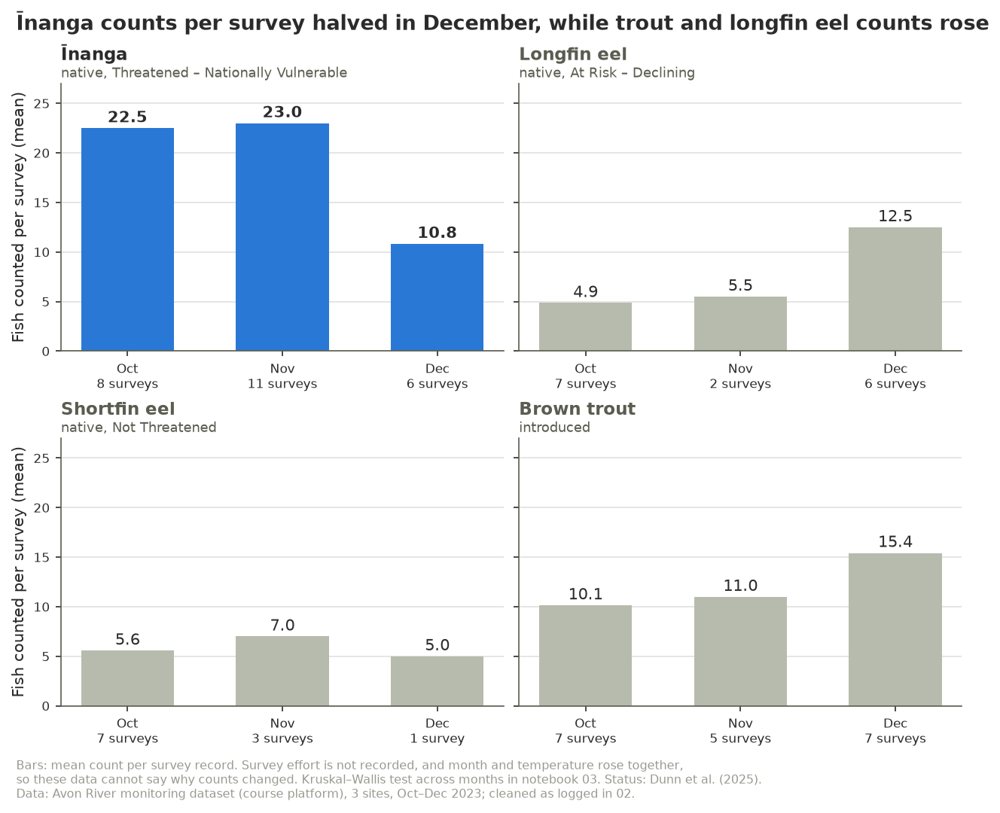
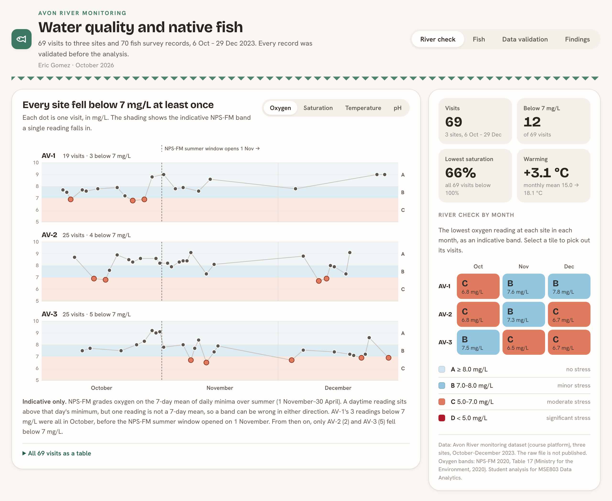

# Avon River water quality and fish, October–December 2023

Eric Gomez · October 2026

This project analyses an environmental organisation's monitoring records from three sites on the Avon River
(AV-1, AV-2 and AV-3). The records cover water temperature, pH and dissolved oxygen at each visit, and the
count and mean size of four fish species. The analysis asks three things:
- what the records show about the conditions native fish face;
- whether fish numbers track water quality;
- what the data cannot answer.

## Approach

| Notebook | What it does |
|---|---|
| [`01_data_understanding`](notebooks/Ass1-Avon_01_data_understanding.ipynb) | Profiles the raw file and validates it record by record. Each problem is classified as a critical anomaly, a data-integrity error, a statistical outlier or missing data. Every decision cites its Excel rows and the evidence behind it. |
| [`02_eda`](notebooks/Ass1-Avon_02_eda.ipynb) | Applies the cleaning and derives oxygen saturation and an indicative NPS-FM band. Summarises every problem in a data validation and management matrix, with the computed impact of keeping each one. Describes the data and builds four figures. |
| [`03_analysis`](notebooks/Ass1-Avon_03_analysis.ipynb) | Tests six hypotheses stated in advance (Holm-adjusted) and re-checks the closest result by permutation. Runs the sensitivity analysis across the cleaning judgement calls, and checks whether a predictive model beats the mean. Builds the dashboard. |

The reusable code (loading, quality checks, statistical tests, plotting) lives in `src/`, with standalone tests in `tests/`.
The project structure follows the [MSE803 Analytics Template](../../MSE803-Analytics-Template/).

## Key results

- **Data quality.** 50 of 190 raw rows (26%) were copies, altered copies or invalid. Cleaning leaves 69 visits
  and 70 fish records. Single bad records would have moved the headline numbers: kept, one would have lifted
  December's mean temperature from 18.1 to 23.0 °C, and another would have taken shortfin eel from 5.9 to 255
  fish per survey.
- **Warming.** The river warmed about 3 °C from October to December (monthly means 15.0 → 16.6 → 18.1 °C).
  AV-3 was the warmest site every month, and the sites differ significantly in temperature (Holm p < 0.001).
- **Oxygen.** All 69 visits were below saturation (66–98%). On 12 of them, spread across all three sites, oxygen
  fell under 7 mg/L, the start of indicative NPS-FM band C. AV-1's three were all in October; from 1 November,
  when the NPS-FM summer window opens, only AV-2 and AV-3 fell below 7 mg/L.
- **Īnanga.** Counts per survey of this threatened native fish halved in December (22.5 → 23.0 → 10.8;
  Holm p = 0.03, permutation p = 0.002).
- **No detectable link** at these sample sizes between any species' count and oxygen, saturation, temperature
  or pH. No model predicts counts better than the mean.
- **Robust.** No alternative cleaning decision changes any of these conclusions.



## Dashboard

[`outputs/dashboards/avon_river_dashboard.html`](outputs/dashboards/avon_river_dashboard.html) presents the results for
the organisation's board and the public. It is a single self-contained file: download it and open it in a browser. It
needs no server and loads no outside scripts. It has four views:
- **River check:** every visit's oxygen, saturation, temperature and pH by site, against the indicative NPS-FM bands;
- **Fish:** counts per survey by species, month and site;
- **Data validation:** the four classifications, with the computed impact of keeping each record;
- **Findings:** the six tests, the sensitivity analysis and the model check.

Every number on the page is computed from `data/processed/` and `outputs/tables/`. The site locations are not in the
data, so the dashboard has no map.



## Data

The raw spreadsheet was provided for coursework and is not included in this repository. It is
`Data_Set_Assignmnet_1 - 0426.xlsx`, a single sheet with a water-quality table and a fish table side by side.
The cleaned tables are in `data/processed/` (`visits.csv`, `fish_records.csv`). Every figure and results
table is in `outputs/`.

## Running it

To re-run the analysis from scratch, place the raw file in `data/raw/`, then run the following from this folder:

```bash
pip install -r requirements.txt
jupyter nbconvert --to notebook --execute --inplace notebooks/*.ipynb
python tests/test_cleaning.py      # also test_quality.py, test_models.py and test_dashboard.py
python -m src.visualization.dashboard --screenshot      # optional: the dashboard image above; needs Google Chrome
```

## Context

This analysis was prepared for MSE803 Data Analytics, Assessment 1 (Task 1). The table shows where the
evidence for each part sits.

| Task | Evidence |
|---|---|
| 1-A Environmental challenges | `02`: findings, Figures A and B |
| 1-B Analytical techniques | `03`: hypothesis tests, sensitivity analysis, model-versus-baseline check |
| 1-C Tools and visualisations | `02`: Figures C and D, colour-blindness check; the dashboard |
| 1-D Recommendations | `02`: open questions for the data owner; `03`: summary of findings |
