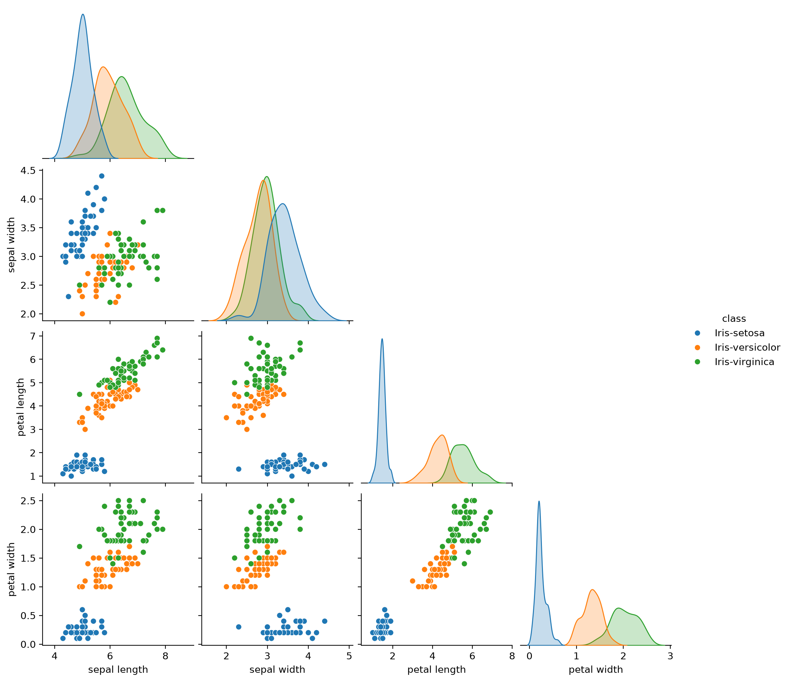

# Week 1 Activity 1: Iris Dataset Exploration

This notebook explores the Iris dataset, fetched from the UCI repository with
`ucimlrepo.fetch_ucirepo(id=53)`. It uses pandas in order to inspect the
predictor features, the target classes, the statistics grouped by species, and
the duplicate records contained in the dataset.

## Findings

The predictor DataFrame `X` has shape `(150, 4)`, so the dataset contains 4
features. The target column `y['class']` holds 3 distinct iris species, which is
confirmed by `y['class'].nunique()`. After combining `X` and `y` into a single
DataFrame called `iris_df`, the call `iris_df.duplicated().sum()` reports 3 exact
duplicate full records.

## Analysis Notes

The feature count must be taken from `X.shape[1]` and not from
`iris_df.shape[1]`, because `iris_df` also includes the class column; in the same
way, the number of species must be obtained with `y['class'].nunique()`.
Duplicate detection is different, since it requires the predictors and the target
in the same DataFrame:

```python
iris_df = X.copy()
iris_df['class'] = y['class']
```

Once `iris_df` exists, `iris_df.groupby('class').describe()` returns the summary
statistics per species, and `iris_df.duplicated().sum()` counts the exact
duplicate records across the full dataset. If duplicates exist, the notebook also
displays them with:

```python
iris_df[iris_df.duplicated(keep=False)]
```

## Notebook Contents

1. Load the Iris dataset and inspect its metadata and variable descriptions.
2. Count the target classes and verify the class balance.
3. Inspect the feature-level statistics with `X.info()` and `X.describe()`.
4. Combine `X` and `y` into `iris_df` and compute the statistics grouped by class.
5. Count the duplicate full rows in `iris_df` and display them if any are found.

## Dataset Summary

- Total instances: 150
- Predictor features: `sepal length`, `sepal width`, `petal length`, `petal width`
- Target: `class` (`Iris-setosa`, `Iris-versicolor`, `Iris-virginica`)
- Exact duplicate full records: 3

## Pairplot Visualization

The notebook also produces a Seaborn pairplot of `iris_df` with the points
colored by `class`.


