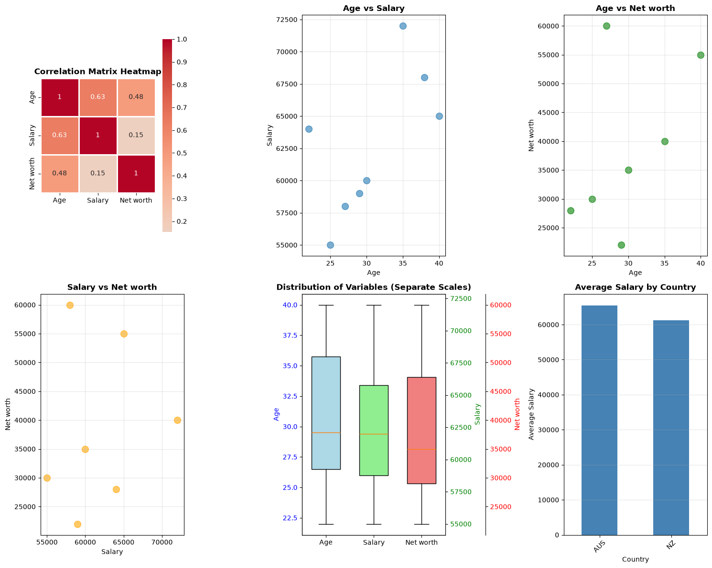
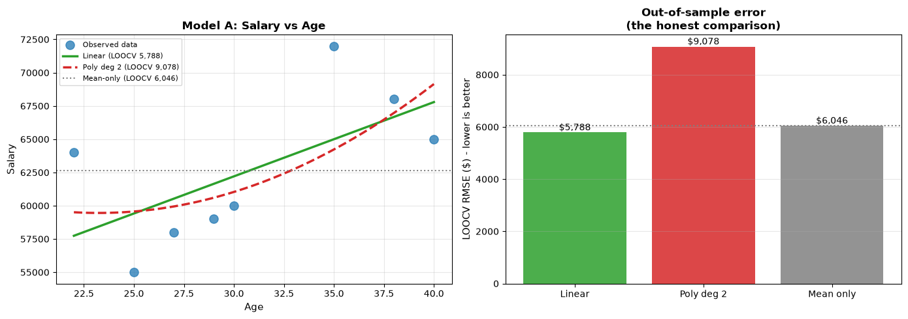
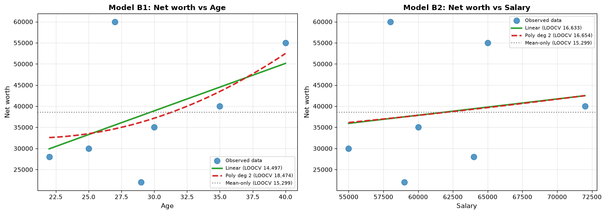
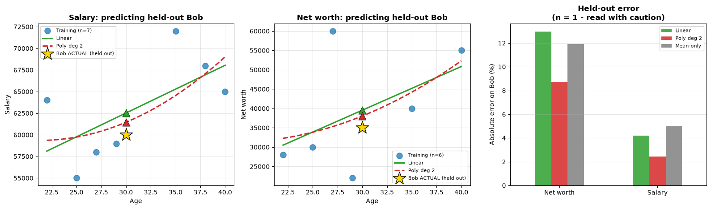

# Week 3, Activity 1-2: Statistical Data Analysis and Prediction for Missing Value

Cleans a small, messy sample dataset (Age, Salary, Net worth, Country), runs a descriptive
analysis, and imputes missing values with linear vs. polynomial regression.

- Code: [`notebooks/W3Act1-2.ipynb`](notebooks/W3Act1-2.ipynb), using helpers from
  [`src/cleaning.py`](src/cleaning.py) and [`src/modeling.py`](src/modeling.py)
- Data: [`data/raw/Sample_dataset.csv`](data/raw/Sample_dataset.csv) →
  [`data/processed/W3Act1-2_cleaned_imputed.csv`](data/processed/W3Act1-2_cleaned_imputed.csv)

## 1. Descriptive statistics

n = 9 people (Age n=8, Net worth n=7, smaller due to missing values).

| | Age | Salary | Net worth |
|---|---|---|---|
| Mean | 30.75 | 62,625 | 38,571 |
| Std dev | 6.36 | 5,655 | 14,164 |
| Variance | 40.50 | 31,982,143 | 200,619,048 |
| Range | 22-40 | 55,000-72,000 | 22,000-60,000 |

**Correlation matrix**

| | Age | Salary | Net worth |
|---|---|---|---|
| Age | 1.00 | 0.63 | 0.48 |
| Salary | 0.63 | 1.00 | 0.15 |
| Net worth | 0.48 | 0.15 | 1.00 |

Age and Salary have the strongest relationship in the data (r = 0.63). Salary and Net
worth are essentially uncorrelated (r = 0.15), which is why Net worth is predicted from
Age later, not Salary. Split by country, mean Age is identical (32.0) in AUS and NZ, but
Salary and Net worth both run higher in AUS on this sample.

## 2. Predicting the missing values

After cleaning, 9 cells are still missing. Regression needs a predictor present on the same
row, which rules most of them out (an ID, a Name, a Join Date). Only two cells have one:

| Missing value | Predictor | Regression | Imputed value |
|---|---|---|---|
| David's Net worth | Age (numeric) | Linear vs. polynomial | 47,884.91 |
| Heidi's Age | Country (categorical, one-hot) | Linear only* | 32.00 |

\* Country is a 0/1 dummy, so a squared term is identical to the linear term: no separate
polynomial model exists for it.

**Linear vs. polynomial, compared on LOOCV (leave-one-out cross-validation) RMSE.** Each
model is refit n times, once per point left out, so the comparison isn't inflated by
training-set fit:

| Predictor pair | Model | R² (train) | LOOCV RMSE |
|---|---|---|---|
| Salary ← Age | Linear | 0.395 | 5,788 |
| Salary ← Age | Polynomial (deg 2) | 0.432 | 9,078 |
| **Net worth ← Age** | Linear | 0.235 | 14,497 |
| **Net worth ← Age** | Polynomial (deg 2) | 0.251 | 18,474 |

**Linear wins both pairs on LOOCV**, despite the polynomial's higher training R². At
n = 7-8 the squared term fits noise rather than a real curve, so it generalises worse.
David's Net worth was imputed with the linear model. Heidi's Age ← Country model returns
R² = 0.0000 (mean Age is identical in both countries), so 32.00 is really the dataset
average dressed up as a prediction, and is flagged low-confidence in the output data.

## 3. Sanity check: predicting Bob's known Salary and Net worth

Bob's record is complete, so it doubles as a genuine held-out test: retrain both models
with Bob removed entirely, predict his Salary and Net worth from his Age alone, then
compare against his real recorded values.

| Target | Linear pred. | Poly deg 2 pred. | Actual | Linear error | Poly error |
|---|---|---|---|---|---|
| Salary | 62,527 | 61,455 | 60,000 | 4.2% | 2.4% |
| Net worth | 39,543 | 38,050 | 35,000 | 13.0% | 8.7% |

On this single case the polynomial happens to land closer, the opposite of the LOOCV
ranking above. With only one test point, that's not a contradiction worth trusting: one
lucky guess doesn't outweigh an average over every person in the dataset. LOOCV uses all
7-8 people rather than 1, and remains the basis for preferring linear regression.
