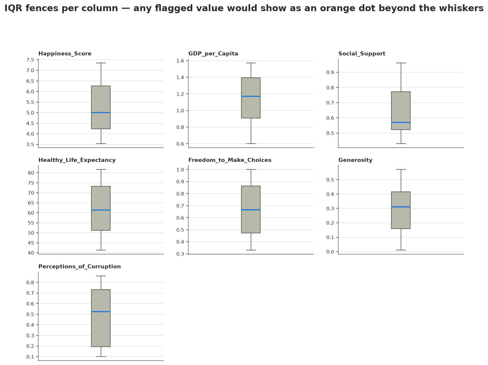
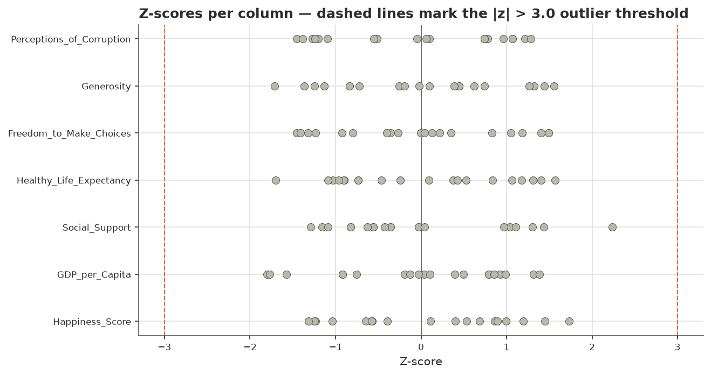
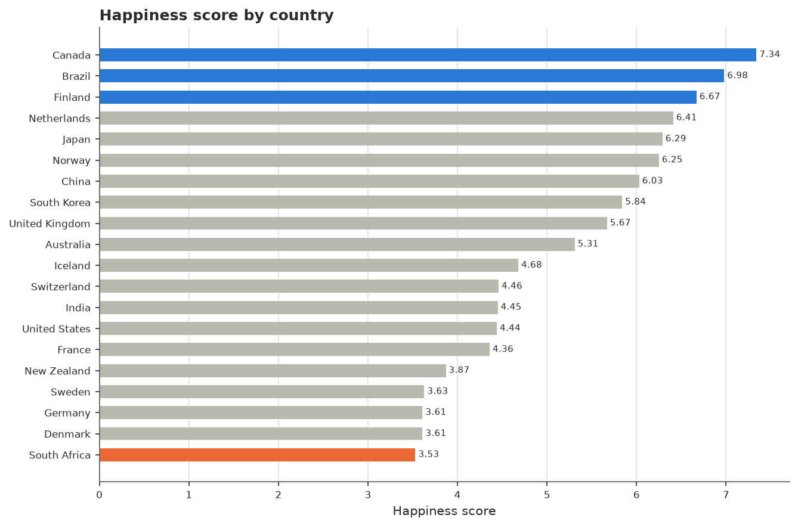
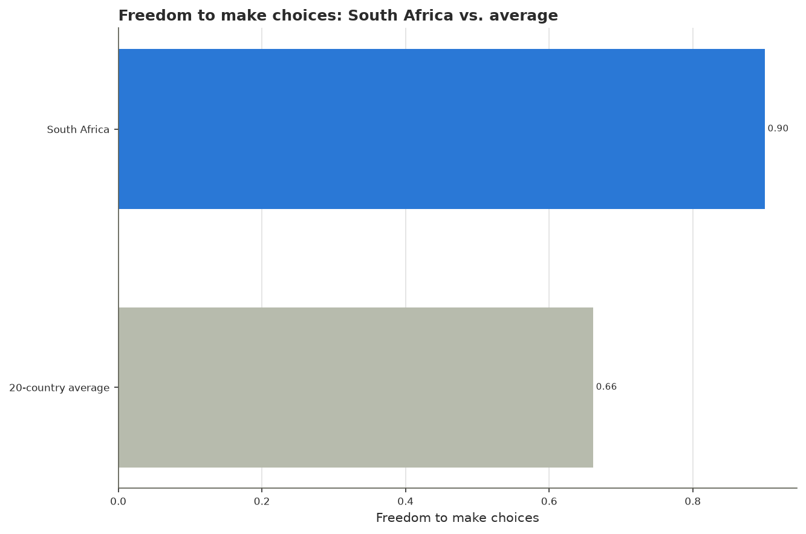
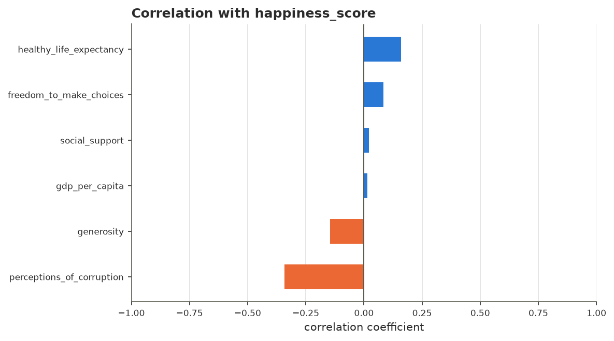
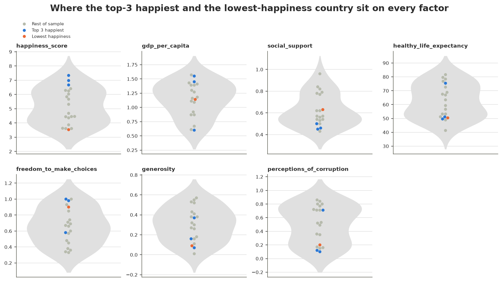

# Week4- Activity1.1-1.2: Happiness Dashboard, Data Visualisation and Outlier Detection

This analysis ranks the 20 countries in the dataset by happiness, compares the freedom
score of the lowest-scoring country against the sample average, and examines whether any
of the six recorded factors correlates with happiness, in order to determine whether
Freedom_to_Make_Choices, in particular, plays the role that a first glance at the data
might suggest. Two independent outlier-detection methods, namely IQR and Z-score, were
also applied to every numeric column, in order to determine whether any value should be
excluded before these comparisons were drawn. The main finding is that South Africa
constitutes a genuine anomaly, not only with respect to freedom but also with respect to
social support, since both scores exceed the sample average despite its being the
lowest-ranked country on happiness; however, no factor in the sample correlates strongly
with happiness overall, and both outlier-detection methods agree that no value in the
dataset needs to be removed.

- **Code:** [`notebooks/`](../notebooks/): `01_data_understanding.ipynb` and
  `02_eda.ipynb`. This question required neither a hypothesis test nor a predictive model,
  so no further notebooks were used.
- **Data:** [`data/raw/world_happiness_dataset.csv`](../data/raw/world_happiness_dataset.csv).
  No processed output was produced, since nothing in the dataset required cleaning or
  exclusion.
- **Source:** not stated by the file itself; no collection period or source organisation
  is given. One row corresponds to one country, with 20 rows in total.

## The Question

This analysis addresses four related questions: which three countries rank highest on
`Happiness_Score`; how the `Freedom_to_Make_Choices` score of the lowest-ranked country
compares with the 20-country average; whether any of the six recorded factors is
associated with happiness; and whether IQR and Z-score screening flags any value in the
dataset as statistically unusual. The answer is intended for the marker assessing this
dashboard, in order to verify that each requirement in the assignment brief is supported
by evidence computed directly within the notebooks rather than asserted without support.

## 1. The Data

The dataset comprises 20 rows and 8 columns, namely `Country` and seven numeric measures.
No values were missing (0 of the 160 cells), and no row required cleaning.

| | Happiness_Score | Freedom_to_Make_Choices |
|---|---|---|
| Mean | 5.17 | 0.66 |
| Std dev | 1.25 | 0.23 |
| Range | 3.53–7.34 | 0.33–1.00 |
| Missing | 0 | 0 |

### Outlier screening: IQR and Z-score

Two independent methods were applied to every numeric column, in order to determine
whether any value should be treated as an outlier before it entered the ranking,
correlation, and dashboard work that follows.

1. **IQR (interquartile range).** For each column, Q1 (the 25th percentile) and Q3 (the
   75th percentile) were computed, followed by IQR = Q3 − Q1. A value is flagged if it
   falls below Q1 − 1.5×IQR or above Q3 + 1.5×IQR. This bound was computed twice, namely
   by hand and via `outlier_report()`, and the two calculations agree exactly.
2. **Z-score.** For each column, every value's distance from that column's mean was
   expressed in standard-deviation units. A value is flagged if its absolute Z-score
   exceeds 3.0.

Both methods were applied to all seven numeric columns, and both agree: zero values are
flagged by either method, so there is no ambiguous value for either to adjudicate, and no
basis for removing any record from this dataset. The two figures below confirm this
visually. Every box plot's whiskers, which mark the IQR fence, bound all 20 points with no
flier beyond them; and every point in the Z-score plot sits well inside the |z| = 3.0
threshold, the closest being a single `Social_Support` value at z ≈ 2.2, still comfortably
short of the line.

## 2. Findings

**Canada, Brazil and Finland are the three happiest countries in the sample.** Their
happiness scores, namely 7.34, 6.98 and 6.67 respectively, are each clearly ahead of the
fourth-ranked country, the Netherlands, whose score of 6.41 marks a distinct gap rather
than a marginal one.

**South Africa, the lowest-happiness country in the sample (3.53), has an above-average
freedom score.** Its `Freedom_to_Make_Choices` score of 0.90 exceeds the 20-country
average of 0.66, which is the opposite of what a naive reading of the term "lowest
happiness" would predict.

**No factor correlates strongly with happiness in this sample.** The strongest Pearson
correlation with `Happiness_Score` is that of `Perceptions_of_Corruption`, at r ≈ −0.34;
`Healthy_Life_Expectancy` follows at r ≈ 0.16, while `Freedom_to_Make_Choices`, the factor
the South Africa case above might suggest is important, is one of the weakest, at r ≈
0.08. This finding is precisely the evidence that the South Africa case constitutes an
anomaly rather than a pattern: it is a single data point set against a near-zero overall
relationship.

**The freedom anomaly is not isolated to a single factor.** A combined view of every
recorded measure, comparing the three happiest countries and South Africa against the
rest of the sample, shows South Africa's `Social_Support` score (0.63) exceeding all
three happiest countries (0.46, 0.45 and 0.50, for Canada, Finland and Brazil
respectively), and its `Healthy_Life_Expectancy` (50.4) sitting close to two of them
(49.6 and 51.1) rather than at the bottom of the sample. Only `Perceptions_of_Corruption`
and `Generosity` place it nearer the low end. This is a second, independent line of
evidence for the same conclusion as the correlation panel above: in this sample, the
recorded factors do not consistently line up with the happiness ranking.

## 3. What This Does Not Show

Correlation is association rather than causation; nothing in this analysis establishes
that `Perceptions_of_Corruption`, or any other factor, drives `Happiness_Score`. The
comparison drawn for South Africa's freedom score must not, in particular, be read as
evidence that freedom drives happiness, since it concerns a single country set against a
sample-wide correlation of only r ≈ 0.08 for that factor. Furthermore, this is a 20-row,
cross-sectional sample with no stated source or collection period; the findings therefore
describe this specific sample only and do not generalise to the full set of countries
covered by the World Happiness Report, or to any other year. No comparison to that report
is made anywhere in this analysis, since no source for such a comparison is available
here.

## 4. Method

| Decision | Choice | Reason |
|---|---|---|
| Missingness handling | Not applicable | 0 missing values |
| Outlier handling | Keep all 20 rows | IQR and Z-score are independent methods and both flag 0 values at standard thresholds |
| Correlation method | Pearson | Max \|skew\| < 1, 0 outliers by either method: Pearson's failure modes checked and found absent |
| Statistical test | Not applicable | Descriptive question; no group comparison posed |
| Model (if any) | Not applicable | No predictive question in the brief |

## 5. Limitations

- **Sample:** n = 20 countries, a subset of those covered by the World Happiness Report,
  with no stated rule for how this particular subset was selected; consequently, the
  findings do not represent global patterns.
- **Assumptions:** Pearson's correlation assumes linearity, which was checked via the
  skew and outlier screen rather than simply assumed; countries are also treated as
  independent observations, although geographic or economic clustering among them is not
  modelled.
- **Validation:** not applicable, since no model was fit and there is therefore no
  out-of-sample estimate to report.
- **Would change with:** a stated data source and collection period, a larger and
  explicitly sampled set of countries, or repeated years, in order to test whether the
  relationship between freedom and happiness is stable over time.
